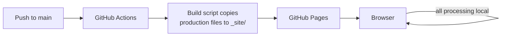

## Overview

Utilities like a PDF merger, a timezone converter, or a hash generator don't
need a framework, a build pipeline, or a server. Each one is a single HTML
file that does one job in the browser and nothing else — no settings panel
that turns a date calculator into a timezone converter into a calendar app.
When a second, related need shows up, that's a new tool, not a feature flag
on the first one.

## Use case

Small, self-contained tools with no persistence needs beyond the current
tab: convert this, format that, compute this once. Input arrives, output
appears, nothing leaves the browser. The moment a "tool" needs accounts,
shared state across sessions, or server-side processing, it's no longer
this pattern.

## When not to use this pattern

The same boundary as above, stated as an exit condition. Reach for
something else once a tool's actual needs cross it:

- **The tool needs a backend** — heavier processing than a browser can do,
  a server-only API, or persistence beyond the current tab. That's a
  server-side app's job; this pattern gives it up on purpose, to stay
  privacy-first and infrastructure-free, not by accident.
- **The tool needs shared, stateful UI across many tools** — once
  duplicating common UI across single-file tools becomes the actual cost
  (real interactive complexity, well past a few dozen tools), a
  bundler/framework build's shared-component layer starts earning the
  build step and runtime it adds.

## Options considered

A server-side app and a bundler/framework build were both ruled out for
the reasons above. What's actually in production:

### Static HTML on Pages

One `<tool-name>.html` file per tool, vanilla JS, no build step. Deployed
straight to GitHub Pages.

- **For:** zero infrastructure, zero cost, trivially auditable (the whole
  tool is one file you can read top to bottom), nothing to keep upgraded.
- **Against:** no shared component layer, so common UI (back-link, result
  box, status messages) is duplicated via a shared stylesheet rather than
  shared components. Fine at the current scale; would need revisiting past
  a few dozen tools.

## Current recommendation

Single-file static HTML, no build step, deployed to GitHub Pages. Shared
look and feel comes from one common stylesheet, not a component framework.
Revisit only if a tool's interactivity genuinely outgrows what vanilla JS
in one file can hold.

Third-party libraries are vendored into the repo (`vendor/<package>@<version>/`),
never loaded from a CDN at runtime. Every tool ships a strict
Content-Security-Policy — `default-src 'none'`, `connect-src 'none'` by
default — so the browser itself refuses any network call a tool doesn't
explicitly declare a need for. A tool that genuinely needs one (an AI
feature calling an LLM API) states it as a scoped, named exception in that
tool's own CSP, not a site-wide loosening.

## Architecture

