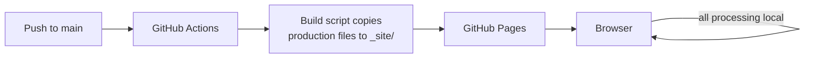

## Overview

Utilities like a PDF merger, a timezone converter, or a hash generator don't
need a framework, a build pipeline, or a server. Each one is a single HTML
file that does one job in the browser and nothing else.

## Use case

Small, self-contained tools with no persistence needs beyond the current
tab: convert this, format that, compute this once. Input arrives, output
appears, nothing leaves the browser. The moment a "tool" needs accounts,
shared state across sessions, or server-side processing, it's no longer
this pattern.

## Options considered

### Static HTML on Pages

One `<tool-name>.html` file per tool, vanilla JS, no build step. Deployed
straight to GitHub Pages.

- **For:** zero infrastructure, zero cost, trivially auditable (the whole
  tool is one file you can read top to bottom), nothing to keep upgraded.
- **Against:** no shared component layer, so common UI (back-link, result
  box, status messages) is duplicated via a shared stylesheet rather than
  shared components. Fine at the current scale; would need revisiting past
  a few dozen tools.

### Server-side app

A backend service handling the conversion/processing, with the browser as
a thin client.

- **For:** can do work a browser can't (heavier processing, server-only
  APIs, persistence).
- **Against:** infrastructure to run and pay for, a server in the path of
  user data for tools that don't need one, violates privacy-first for no
  benefit on this class of tool.

### Bundler/framework build

React/Vue (or similar) with a build step, shared components, and a proper
dependency graph.

- **For:** shared components stop the duplication a static-HTML approach
  accepts; better for tools with real interactive complexity.
- **Against:** a build step and a framework runtime for tools that are
  fundamentally "take input, transform it, show output." Adds a class of
  failure (the build breaks) that a single static file can't have.

## Current recommendation

Single-file static HTML, no build step, deployed to GitHub Pages. Shared
look and feel comes from one common stylesheet, not a component framework.
Revisit only if a tool's interactivity genuinely outgrows what vanilla JS
in one file can hold.

Third-party libraries are vendored into the repo (`vendor/<package>@<version>/`),
never loaded from a CDN at runtime. Every tool ships a strict
Content-Security-Policy — `default-src 'none'`, `connect-src 'none'` by
default — so the browser itself refuses any network call a tool doesn't
explicitly declare a need for. A tool that genuinely needs one (an AI
feature calling an LLM API) states it as a scoped, named exception in that
tool's own CSP, not a site-wide loosening.

## Architecture

