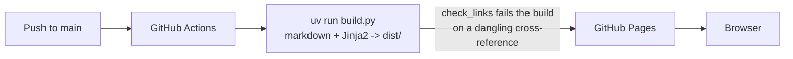

## Overview

Some content isn't an interactive artifact, it's a body of written decisions
meant to be read: principles, decision records, this bundle itself. The
right authoring format for that is markdown, not hand-written HTML — prose,
headers, and cross-references between records are what markdown is for. Markdown
to a browser is, unavoidably, a transform step, so this pattern accepts a
build rather than pretending one isn't needed.

## Use case

A growing set of written records that cross-reference each other (a
principle linking to the patterns that follow from it, a pattern linking
back to the principles behind it) and share one consistent look across
every page. The content is the point; there's no interactivity beyond
reading and following links.

## When not to use this pattern

- **The content is the interactive artifact itself** — that's the [HTML
  tool pattern](../patterns/html-tools.html) instead: no prose to convert,
  nothing to gain from markdown.
- **There are only a page or two, with no real cross-referencing between
  them yet** — at that scale a generator is solving a problem that doesn't
  exist yet. Hand-authored static HTML, the same way the HTML tool pattern
  does it, is simpler and has one less thing pinned. This pattern earns
  its build step once there are enough records that (a) a shared
  header/footer edited by hand across every page invites drift, and (b) a
  broken cross-reference between records can go unnoticed without
  something checking for it at build time.

## Options considered

### Hand-authored static HTML, no build step

The same shape as the HTML tool pattern: write each page's HTML directly,
share a stylesheet, no generator.

- **For:** zero dependencies, matches how `tools/` already works,
  trivially auditable.
- **Against:** markdown's prose ergonomics are gone — every heading, list,
  and link is hand-written HTML. Worse, nothing catches a stale
  cross-reference: rename or remove a record and every other page linking
  to it silently breaks, with no build to fail on it.

### An off-the-shelf static site generator (Jekyll)

GitHub Pages builds Jekyll natively, so markdown-with-frontmatter in gets
HTML out with no custom code.

- **For:** batteries included — markdown parsing, collections, and
  templating all come for free.
- **Against:** the templating work doesn't disappear, it moves — matching
  this site's existing look-and-feel (the shared Pico base, the
  `.home-link`/`.back-link` conventions) still means writing an equivalent
  layout, just in Liquid instead of Jinja2. GitHub's hosted Jekyll build
  also doesn't let this repo pin exact gem versions the way
  [Minimal dependencies](../principles/minimal-dependencies.html) asks for
  — it builds on whatever Jekyll/kramdown GitHub's image ships that week.
  Pinning that back down means a self-hosted build with its own
  Ruby/bundler toolchain — a second language ecosystem, not a smaller
  one. And the one invariant this bundle actually needs enforced —
  failing the build on a dangling cross-reference between principles and
  patterns — isn't something stock Jekyll checks; it would need a plugin,
  which GitHub's hosted build restricts, pushing back toward self-hosting
  anyway.

### A small, purpose-built script (current)

`build.py`: markdown + YAML frontmatter in, rendered through Jinja2
templates, out as static HTML — exactly-pinned dependencies
(`pyproject.toml` with `==`, a committed `uv.lock`), matching [Minimal
dependencies](../principles/minimal-dependencies.html).

- **For:** one language, one pinned dependency set, and the templates are
  plain HTML + Jinja2 rather than a second templating language to learn.
  `check_links` fails the build the moment any record links to a
  principle or pattern slug that doesn't exist — the exact invariant this
  bundle needs, and nothing more than that.
- **Against:** bespoke. No plugin ecosystem, no community themes —
  whoever maintains this owns the build script itself.

## Current recommendation

The purpose-built script. It's the only option that gets exact dependency
pinning, matches the site's existing look-and-feel without a second
templating language, and enforces the one invariant (no dangling
cross-references between records) that actually matters at this bundle's
scale — without adopting a second language ecosystem to get there.

## Related principles

This pattern's recommendation follows from three of the bundle's
principles: [Minimal dependencies](../principles/minimal-dependencies.html)
— exact-pinned Python dependencies and a committed lockfile, not whatever
GitHub's hosted Jekyll happens to ship; [No egress by
default](../principles/no-egress-by-default.html) — the build is a pure,
offline transformation, bundle and templates in, `dist/` out; and [Least
privilege](../principles/least-privilege.html) — the deploy workflow's
token is scoped to exactly `contents: read`, `pages: write`, `id-token:
write`, nothing broader.

## Architecture

