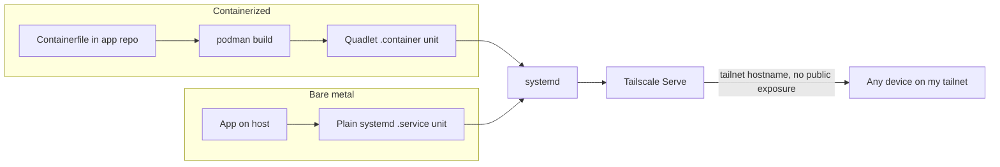

## Overview

Some things aren't a static HTML tool: they need a persistent process, real
backend logic, or state beyond a browser tab. Those run as a
systemd-managed service — bare-metal, or a Podman container when the app
needs isolation the host can't give it for free — kept entirely private:
reachable only by me, never the public internet.

## Use case

An app I use — or share with people I already trust with network access —
that needs an actual backend: a server process, persistent state,
background work a browser can't do alone. Not meant to be public.

## When not to use this pattern

- **The app has no backend need at all** — the HTML tool pattern instead:
  static, no container, public by default.
- **The app genuinely needs to be reachable by the public** — that's a
  different pattern, not this one. Whether that's the same runtime exposed
  publicly instead of privately, or something with no private network
  involved at all (Cloudflare Workers, say) is a separate decision this
  pattern deliberately doesn't make.

## Options considered

### How to keep it private

This is the actual decision the pattern's name refers to, and the one most
likely to change later — worth recording properly rather than just
asserting today's pick:

- **Firewall rules / cloud security-group allowlists only:** no extra
  software, works on any host as-is.
  - **Against:** brittle (an IP allowlist breaks the moment I'm on a new
    network), no easy access from more than one place, no real identity —
    just an address.
- **Manual SSH tunnel or port-forward per session:** zero standing
  infrastructure, nothing running when I'm not using it.
  - **Against:** one device, one session at a time — not always-on access
    from whichever of my devices I happen to be using.
- **A self-hosted VPN (WireGuard, run and patched by me):** full control,
  no third party anywhere in the path.
  - **Against:** I'm now the one running and patching VPN infrastructure,
    and every device needs its own manual configuration.
- **An edge tunnel (Cloudflare Tunnel):** also no inbound ports, outbound-only
  connector to Cloudflare's edge, and the same system can front a public
  app later via the same product.
  - **Against:** private access means configuring Cloudflare Access
    policies per app rather than just being on a network; the traffic
    itself terminates at Cloudflare's edge, not end-to-end between my
    devices.
- **A managed mesh VPN (Tailscale):** near-zero setup, works across NAT and
  firewalls automatically, real per-device identity, and `serve`/`funnel`
  give a simple private/public toggle without extra infrastructure.
  - **Against:** a third-party control plane sits between my devices, even
    though the traffic itself is end-to-end (WireGuard-based); this
    depends on that service staying up and trustworthy.

### Whether to containerize at all

A separate, orthogonal decision — not an either/or across the board, both
shapes are accepted, chosen per app:

- **Bare-metal systemd unit:** the app runs directly on the host, no
  container layer. Right call when it has no unusual dependencies, needs
  nothing the host doesn't already provide, and isn't fighting anything
  else on that host for a runtime version.
- **Podman container, defined as a quadlet:** the app runs rootless,
  managed by systemd the same way a bare-metal unit would be. Right call
  once the app needs dependency isolation, a specific runtime version, or
  to move cleanly to a different host later.

Both converge on the same operational shape below — `systemctl
start`/`enable`, logs via journald, a restart policy for free. The
trade-off is isolation and portability against nothing standing between
the process and the OS; nothing about this pattern forces the choice one
way.

### Docker (when an app is containerized)

- **For:** the default assumption in most tutorials and tooling,
  `docker-compose` familiar, a huge ecosystem of pre-built images.
- **Against:** a root-owned daemon is both a single point of failure and a
  larger attack surface than this needs; rootless Docker exists but isn't
  the path most docs or images assume. Podman gets the same rootless
  result without opting out of a default.

## Current recommendation

Tailscale, chosen over the alternatives above mainly because it's the
easiest to get up and running — not a deeper claim that it beats Cloudflare
Tunnel or a self-hosted WireGuard on their merits, just the one that took
the least setup. Specifically Serve rather than Funnel: reachable by
tailnet hostname from any of my own devices, invisible to anything not on
the tailnet. Deliberately not Funnel — nothing here is meant to be public.

Whichever shape an app needs, it ends up as a systemd unit: a plain
`.service` for a bare-metal app, or a quadlet (a `.container` file) for a
containerized one — `systemctl start`/`enable`, journald logs, restart
policy either way. When containerized, the image builds from a
`Containerfile` in the app's own repo; no local registry yet, plausible
later if the build step ever needs to move off the host. No reverse proxy
sits in front either way.

The pattern doesn't care what the host actually is — a VPS, bare metal, a
VM. Only the box underneath, whether that particular app is containerized,
and — if it ever stops being Tailscale — how privacy is enforced, can
change without this pattern's name or intent changing with it.

## Architecture

