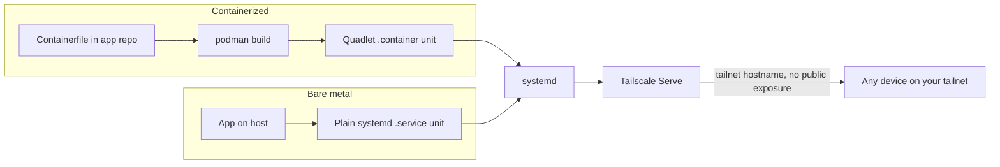

## Overview

Some things aren't a static HTML tool: they need a persistent process, real
backend logic, or state beyond a browser tab. Those run as a
systemd-managed service — bare-metal, or a Podman container when the app
needs isolation the host can't give it for free — reached only over your
own tailnet via Tailscale Serve, never the public internet.

## Use case

An app you — or people already on your tailnet — use, that needs an actual
backend: a server process, persistent state, background work a browser
can't do alone. Not meant to be public. Tailscale Serve, not Funnel, is the
point: reachable by tailnet hostname from any of your own devices,
invisible to everything else.

## When not to use this pattern

- **The app has no backend need at all** — the HTML tool pattern instead:
  static, no container, public by default.
- **The app genuinely needs to be reachable by people outside your
  tailnet** — that's a different pattern, not this one. Whether that's the
  same Podman/quadlet setup exposed via Tailscale Funnel instead of Serve,
  or something with no tailnet involvement at all (Cloudflare Workers, say)
  is a separate decision this pattern deliberately doesn't make.

## Options considered

### Whether to containerize at all

Not an either/or across the board — both shapes are accepted, chosen per
app:

- **Bare-metal systemd unit:** the app runs directly on the host, no
  container layer. Right call when it has no unusual dependencies, needs
  nothing the host doesn't already provide, and isn't fighting anything
  else on that host for a runtime version.
- **Podman container, defined as a quadlet:** the app runs rootless,
  managed by systemd the same way a bare-metal unit would be. Right call
  once the app needs dependency isolation, a specific runtime version, or
  to move cleanly to a different host later.

Both converge on the same operational shape below — `systemctl
start`/`enable`, logs via journald, a restart policy for free, reachable
only via Tailscale Serve. The trade-off is isolation and portability
against nothing standing between the process and the OS; nothing about
this pattern forces the choice one way.

### Docker (when an app is containerized)

- **For:** the default assumption in most tutorials and tooling,
  `docker-compose` familiar, a huge ecosystem of pre-built images.
- **Against:** a root-owned daemon is both a single point of failure and a
  larger attack surface than this needs; rootless Docker exists but isn't
  the path most docs or images assume. Podman gets the same rootless
  result without opting out of a default.

## Current recommendation

Whichever shape an app needs, it ends up as a systemd unit: a plain
`.service` for a bare-metal app, or a quadlet (a `.container` file) for a
containerized one — `systemctl start`/`enable`, journald logs, restart
policy either way. When containerized, the image builds from a
`Containerfile` in the app's own repo; no local registry yet, plausible
later if the build step ever needs to move off the host.

No reverse proxy sits in front either way. Tailscale Serve exposes the
service's port directly at a tailnet hostname — reachable from any of your
own devices, invisible to anything not on the tailnet. Deliberately Serve,
not Funnel: nothing here is meant to be public.

The pattern doesn't care what the host actually is — a VPS, bare metal, a
VM. systemd and Tailscale Serve stay the same regardless; only the box
underneath, and whether that particular app is containerized, changes.

## Architecture

