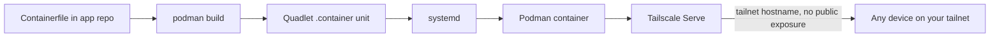

## Overview

Some things aren't a static HTML tool: they need a persistent process, real
backend logic, or state beyond a browser tab. Those get deployed as a
Podman container, managed by a systemd quadlet unit, and reached only over
your own tailnet via Tailscale Serve — never the public internet.

## Use case

An app you — or people already on your tailnet — use, that needs an actual
backend: a server process, persistent state, background work a browser
can't do alone. Not meant to be public. Tailscale Serve, not Funnel, is the
point: reachable by tailnet hostname from any of your own devices,
invisible to everything else.

## When not to use this pattern

- **The app has no backend need at all** — the HTML tool pattern instead:
  static, no container, public by default.
- **The app genuinely needs to be reachable by people outside your
  tailnet** — that's a different pattern, not this one. Whether that's the
  same Podman/quadlet setup exposed via Tailscale Funnel instead of Serve,
  or something with no tailnet involvement at all (Cloudflare Workers, say)
  is a separate decision this pattern deliberately doesn't make.

## Options considered

### Bare-metal service

A systemd unit running the app directly on the host, no container layer.

- **For:** nothing between the process and the OS — simplest possible,
  direct log and file access.
- **Against:** no isolation between apps sharing a host; dependency
  conflicts accumulate; the app's runtime ends up welded to whatever
  happens to be installed on that one machine.

### Docker

- **For:** the default assumption in most tutorials and tooling,
  `docker-compose` familiar, a huge ecosystem of pre-built images.
- **Against:** a root-owned daemon is both a single point of failure and a
  larger attack surface than this needs; rootless Docker exists but isn't
  the path most docs or images assume.

### Podman

- **For:** rootless and daemonless by default, drop-in Docker CLI
  compatibility so existing knowledge transfers, and native systemd
  integration via quadlets — a container becomes a systemd unit, not a
  separate process supervisor to run and monitor.
- **Against:** a smaller ecosystem than Docker for ready-made compose
  files, and occasional compatibility gaps with Docker-first tooling.

## Current recommendation

Podman, one container per app, defined as a systemd quadlet (a
`.container` file) rather than raw `podman run` or `podman-compose` — the
app becomes an ordinary systemd service: `systemctl start`/`enable`,
standard logs via journald, restart policy for free. The image builds from
a `Containerfile` in the app's own repo. No local registry yet; plausible
later if the build step ever needs to move off the host.

No reverse proxy sits in front. Tailscale Serve exposes the container's
port directly at a tailnet hostname — reachable from any of your own
devices, invisible to anything not on the tailnet. Deliberately Serve, not
Funnel: nothing here is meant to be public.

The pattern doesn't care what the host actually is — a VPS, bare metal, a
VM. Podman, quadlet, and Tailscale Serve stay the same regardless; only the
box underneath changes.

## Architecture

